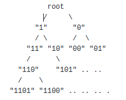
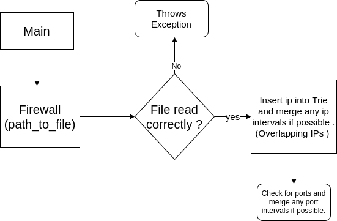

# Illumio-career-step1

## Tasks at Hand:
  - Defining a constructor that takes the path to a CSV file ( **File containing the rules** ) as an argument.
  - Defining an **interface** with a method ( **accept_packet** ) which would be overriden in the class that implements the inteface.
  
## Thought process:
  - An efficient information retrieval structure is required. **Tries** fit in perfectly.
  - What is a Trie ? 
      - It is a search Tree used to store associative array where the keys are usually strings.
      - Diagrammatically:
       - 
  - Why Trie ? 
    - Worse case time complexity for insertion and retrieval of element is O(L) where L is the length of the word.

## Functional Flow :
  - 
  
## If I had more time I would've :
  - Come up with Red-Black tree structure / TreeMap structure / Ternary search tree inorder to reduce space and time complexity as the disadvantage of using Tries is higher memory storage.
  - Above mentioned structures have the advantage that they maintain order which makes operations like minimum, maximum,floor  ,ceiling and k-th largest faster , hence reducing time complexity to O(L Logn) where L is the length of the word and n is total number of words.
  
## Testing : 
   - **Data.csv** containing all the mentioned rules and extra added rules was used for testing. All the mentioned test cases were cleared expeditiously.
   
## Teams intersted in:
 - Data.
 - Policy.
 - Platform.
